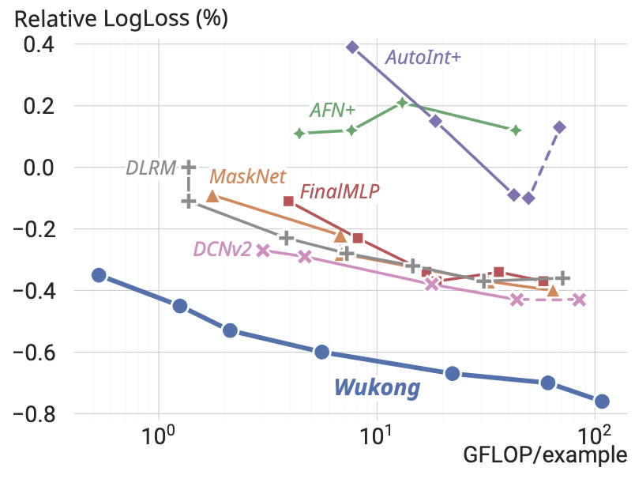
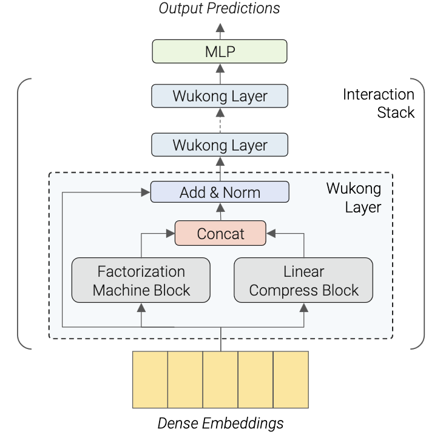

<p align="middle">
  
  
</p>


# Wukong for large-scale recommendation

Unofficial implementation of the paper [Wukong: Towards a Scaling Law for Large-Scale Recommendation](https://arxiv.org/abs/2403.02545v1) from Meta.

It presents a novel state-of-the-art architecture for recommendation systems that additionally follows a similar scaling law of large language models, where the model performance seems to increase with respect to the model scale without a clear asymptote on the scales explored in the paper.

This repository contains implementations for both Pytorch and Tensoflow.

## Usage <a name = "usage"></a>

### Pytorch

```python
import torch
from model.pytorch import WukongTorch


# mock input data
BATCH_SIZE = 1024
NUM_EMBEDDING = 10_000 # vocab size
NUM_CAT_FEATURES = 32
NUM_DENSE_FEATURES = 16

sparse_inputs = torch.multinomial(
    torch.rand((BATCH_SIZE, NUM_EMBEDDING)),
    NUM_CAT_FEATURES,
    replacement=True,
)
dense_inputs = torch.rand(BATCH_SIZE, NUM_DENSE_FEATURES)

# takes hyperparameters from the paper
model = WukongTorch(
    num_layers=3,
    num_emb=NUM_EMBEDDING,
    dim_emb=128,
    dim_input_sparse=NUM_CAT_FEATURES,
    dim_input_dense=NUM_DENSE_FEATURES,
    num_emb_lcb=16,
    num_emb_fmb=16,
    rank_fmb=24,
    num_hidden_wukong=2,
    dim_hidden_wukong=512,
    num_hidden_head=2,
    dim_hidden_head=512,
    dim_output=1,
)

# outputs are the logits and will need to be rescaled with a sigmoid to get a probability
outputs = model(sparse_inputs, dense_inputs)
```

### Tensorflow

```python
import tensorflow as tf
from model.tensorflow import WukongTf


BATCH_SIZE = 1024
NUM_EMBEDDING = 10_000
NUM_CAT_FEATURES = 32
NUM_DENSE_FEATURES = 16

inputs = [
    tf.random.categorical(tf.random.uniform((BATCH_SIZE, NUM_EMBEDDING)), NUM_CAT_FEATURES, dtype=tf.int32),
    tf.random.uniform((BATCH_SIZE, NUM_DENSE_FEATURES)),
]

model = WukongTf(
    num_layers=2,
    num_sparse_emb=NUM_EMBEDDING,
    dim_emb=128,
    num_emb_lcb=16,
    num_emb_fmb=16,
    rank_fmb=8,
    num_hidden_wukong=2,
    dim_hidden_wukong=16,
    num_hidden_head=2,
    dim_hidden_head=32,
    dim_output=1,
    dropout=0.0,
)

outputs = model(inputs)
```

## Citations

```bibtex
@misc{zhang2024wukong,
      title={Wukong: Towards a Scaling Law for Large-Scale Recommendation}, 
      author={Buyun Zhang and Liang Luo and Yuxin Chen and Jade Nie and Xi Liu and Daifeng Guo and Yanli Zhao and Shen Li and Yuchen Hao and Yantao Yao and Guna Lakshminarayanan and Ellie Dingqiao Wen and Jongsoo Park and Maxim Naumov and Wenlin Chen},
      year={2024},
      eprint={2403.02545},
      archivePrefix={arXiv},
      primaryClass={cs.LG}
}
```
